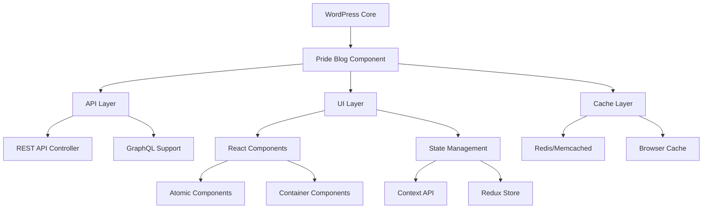

# Pride Plugin - Feature Plan & Roadmap 2024

## Table of Contents
- [Overview](#overview)
- [Architecture Modernization](#architecture-modernization)
- [Feature Roadmap](#feature-roadmap)
- [Technical Implementation](#technical-implementation)
- [Timeline & Phases](#timeline--phases)

## Overview

This document outlines the comprehensive feature plan and implementation roadmap for enhancing the Pride Plugin with modern technologies and advanced capabilities.

## Architecture Modernization

### New Architecture Stack


## Feature Roadmap

### 1. Performance Optimizations
- **Caching System**
  ```php
  [pride_blog cache="true" cache_time="3600"]
  ```
  - Redis/Memcached integration
  - Browser-level caching
  - Static asset caching
  - API response caching

- **Resource Loading**
  - Lazy loading images
  - Code splitting
  - Resource hints implementation
  - Dynamic imports

### 2. Modern Development Stack
- **TypeScript Integration**
  - Type definitions
  - Interface declarations
  - Strict type checking
  - Enhanced IDE support

- **Testing Framework**
  - Unit tests (Jest)
  - E2E tests (Cypress)
  - Integration tests
  - Performance testing

### 3. Enhanced Features

#### Search System
- Elasticsearch integration
- Advanced filters
- Autocomplete
- Search analytics
- Custom ranking algorithms

#### Social Features
```javascript
{
  "features": {
    "social": {
      "sharing": true,
      "reactions": ["like", "celebrate", "support", "insightful"],
      "comments": {
        "nested": true,
        "reactions": true
      },
      "bookmarks": true
    }
  }
}
```

#### Progressive Web App
- Offline support
- Push notifications
- Background sync
- Add to home screen
- Service workers

### 4. UI/UX Improvements

#### Modern Interface
- Fluid typography
- CSS Grid layouts
- Dark mode
- Custom theming
- Micro-interactions

#### Accessibility
- ARIA labels
- Keyboard navigation
- Screen reader optimization
- High contrast mode
- Focus management

### 5. Analytics & Monitoring
```javascript
{
  "monitoring": {
    "performance": {
      "metrics": ["FCP", "LCP", "CLS", "FID"],
      "logging": true,
      "alerts": true
    },
    "usage": {
      "pageViews": true,
      "interactions": true,
      "errors": true
    }
  }
}
```

## Technical Implementation

### 1. API Enhancements
```javascript
// New API Endpoints
GET /wp-json/pride-blog/v2/analytics
GET /wp-json/pride-blog/v2/recommendations
GET /wp-json/pride-blog/v2/user-preferences
POST /wp-json/pride-blog/v2/interactions
```

### 2. Security Measures
- Rate limiting
- CSRF protection
- Input sanitization
- API authentication
- Data encryption

### 3. Development Tools
- Storybook integration
- ESLint configuration
- Prettier setup
- Git hooks
- CI/CD pipeline

## Timeline & Phases

### Phase 1: Foundation (Months 1-2)
- [ ] TypeScript migration
- [ ] Testing framework setup
- [ ] Basic monitoring
- [ ] Security implementation

### Phase 2: Performance (Months 3-4)
- [ ] Caching system
- [ ] Asset optimization
- [ ] Lazy loading
- [ ] Code splitting

### Phase 3: Features (Months 5-6)
- [ ] Enhanced search
- [ ] Social features
- [ ] PWA support
- [ ] Analytics integration

### Phase 4: Polish (Months 7-8)
- [ ] Animations
- [ ] Accessibility
- [ ] Documentation
- [ ] Developer tools

## Integration Guidelines

### 1. Package Management
```json
{
  "dependencies": {
    "typescript": "^5.0.0",
    "react": "^18.0.0",
    "redux": "^4.0.0",
    "elasticsearch": "^7.0.0",
    "jest": "^29.0.0",
    "cypress": "^13.0.0"
  }
}
```

### 2. Configuration
```javascript
// pride-blog.config.js
module.exports = {
  features: {
    cache: true,
    pwa: true,
    analytics: true,
    socialFeatures: true
  },
  performance: {
    lazyLoading: true,
    codeSplitting: true,
    optimization: {
      minify: true,
      treeShaking: true
    }
  }
}
```

## Contribution Guidelines

1. Fork the repository
2. Create feature branch
3. Follow coding standards
4. Write tests
5. Submit pull request

## Support & Documentation

- Technical documentation
- API reference
- User guides
- Troubleshooting
- Performance optimization guides

---

**Note**: This feature plan is a living document and will be updated as the project evolves. Regular reviews and adjustments will be made based on development progress and feedback. 